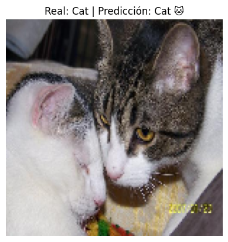
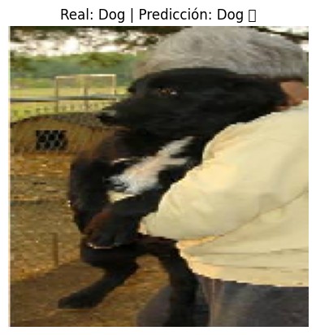
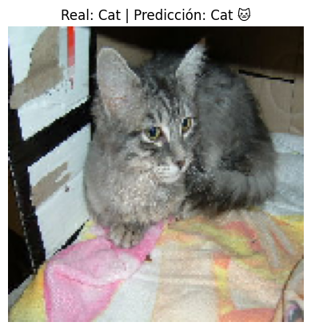
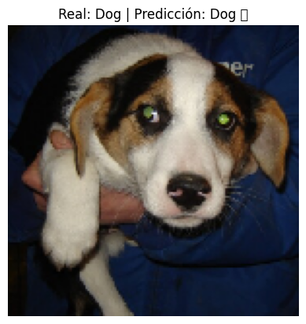
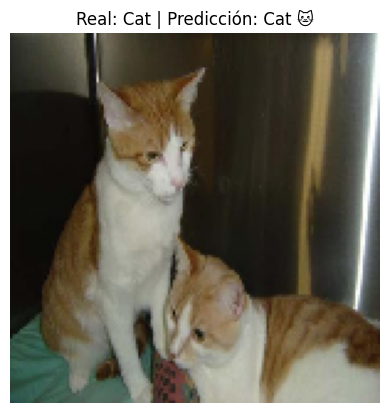
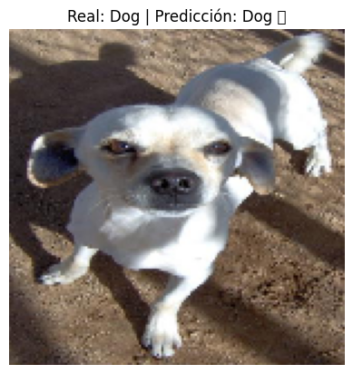

# 🐶😺 Clasificador_de_imagenes

## 🎯 Objetivo

Entrenar una red neuronal convolucional que sea capaz de distinguir si una imagen corresponde a un **perro** o a un **gato**.

---

## 🧠 Modelo utilizado

El modelo es una CNN compuesta por:

- 3 capas convolucionales con ReLU + MaxPooling  
- Capa Flatten + Dense con 512 neuronas  
- Dropout para evitar sobreajuste  
- Capa de salida con activación **sigmoid** para clasificación binaria

Además, se utilizó:

- `ImageDataGenerator` con **data augmentation**  
- `EarlyStopping` para evitar entrenamiento excesivo  

---

## 🗂️ Dataset

Se utilizó el dataset **PetImages** de Microsoft:

- 12.500 imágenes de **gatos** (`Cat/`)  
- 12.500 imágenes de **perros** (`Dog/`)  

Las imágenes fueron reorganizadas en carpetas `train/` (80%) y `validation/` (20%).

---

## 🔍 Resultados

Tras entrenar el modelo:

- **Precisión en entrenamiento:** ~97%  
- **Precisión en validación:** ~75–80%  
- Las curvas de `accuracy` y `loss` muestran un leve sobreajuste, pero están **bien controladas** con técnicas de regularización.

---

## 🖼️ Ejemplos de predicción

A continuación se muestran predicciones reales del modelo sobre imágenes no vistas:

| Imagen Gato | Imagen Perro |
|-------------|--------------|
|  |  |
|  |  |
|  |  |

---

## 📌 Conclusiones

Este proyecto demuestra cómo una arquitectura CNN sencilla puede lograr buenos resultados en tareas de clasificación binaria de imágenes.

El uso de técnicas como **data augmentation**, **regularización** y **early stopping** contribuyó a mejorar la capacidad de generalización del modelo.

El modelo es capaz de alcanzar una **val_accuracy cercana al 80%**, lo que lo convierte en una solución funcional y bien optimizada para el problema propuesto.

